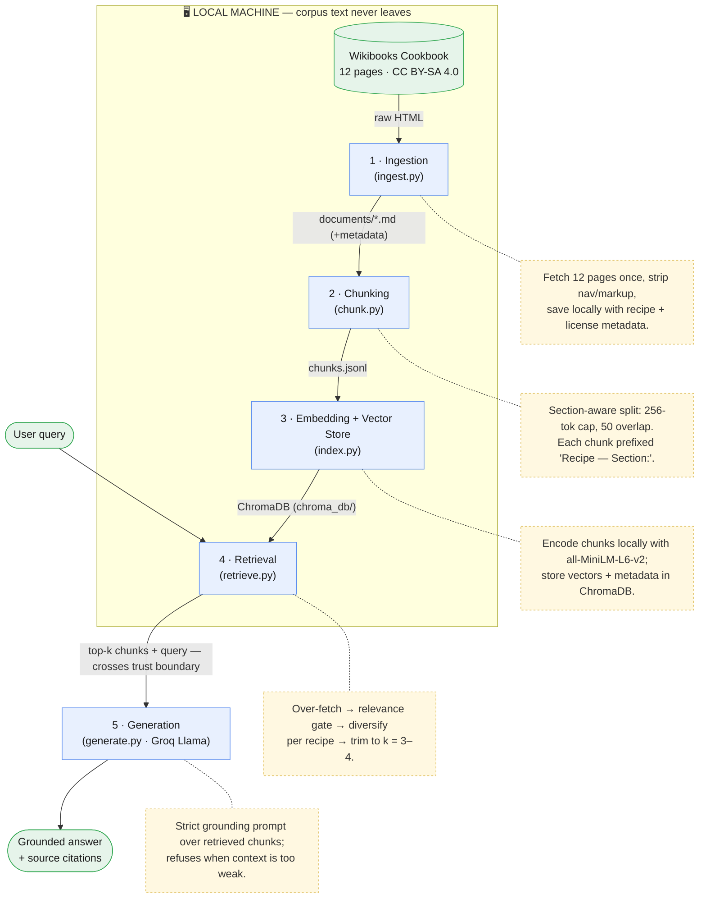

# Project 1 Planning: The Unofficial Guide

> Write this document before you write any pipeline code.
> Your spec and architecture diagram are what you'll use to direct AI tools (Claude, Copilot, etc.) to generate your implementation — the more specific they are, the more useful the generated code will be.
> Update the Retrieval Approach and Chunking Strategy sections if you change your approach during implementation.
> Update this file before starting any stretch features.

---

## Domain

<!-- What domain did you choose? Why is this knowledge valuable and hard to find through official channels? -->

I chose to do korean recipes because a lot of my friends love cooking but there are way too many options out there to choose from. This pipeline aim to simplify the process and get down the most basic recipes that are beginner friendly(especially for myself). 

I want to mention that the Korean recipes themselves aren't hard to find, but in a world where so many recipes are available at our fingertips through web searches, youtube, tik-tok, etc... a simple starting guide like this can be really valuable. That's the simple goal of this project.  

---

## Documents

<!-- List your specific sources: URLs, subreddit names, forum threads, or file descriptions.
     Aim for at least 10 sources that together cover different subtopics or perspectives within your domain. -->

All sources are from the Wikibooks Cookbook, licensed CC BY-SA 4.0.

| # | Source | Description | URL or location |
|---|--------|-------------|-----------------
| 1 | Cookbook:Bulgogi | Marinated grilled beef main dish | https://en.wikibooks.org/wiki/Cookbook:Bulgogi |
| 2 | Cookbook:Bibimbap | Mixed rice bowl with vegetables and egg | https://en.wikibooks.org/wiki/Cookbook:Bibimbap |
| 3 | Cookbook:Cabbage Kimchi | Fermented napa cabbage recipe | https://en.wikibooks.org/wiki/Cookbook:Cabbage_Kimchi |
| 4 | Cookbook:Kimchi | Overview of kimchi varieties | https://en.wikibooks.org/wiki/Cookbook:Kimchi |
| 5 | Cookbook:Galbi | Marinated grilled short ribs | https://en.wikibooks.org/wiki/Cookbook:Galbi |
| 6 | Cookbook:Korean Shortribs | Braised/grilled short ribs variant | https://en.wikibooks.org/wiki/Cookbook:Korean_Shortribs |
| 7 | Cookbook:Gimbap | Seaweed rice rolls | https://en.wikibooks.org/wiki/Cookbook:Gimbap |
| 8 | Cookbook:Naengmyeon | Cold buckwheat noodle dish | https://en.wikibooks.org/wiki/Cookbook:Naengmyeon |
| 9 | Cookbook:Euneo-juk | Korean sweetfish rice porridge | https://en.wikibooks.org/wiki/Cookbook:Euneo-juk_(Korean_Sweetfish_Porridge) |
| 10 | Cookbook:Quail Egg and Chili Jangjorim | Soy-braised quail eggs side dish | https://en.wikibooks.org/wiki/Cookbook:Quail_Egg_and_Chili_Jangjorim |
| 11 | Cookbook:Gochujang | Fermented chili paste (ingredient) | https://en.wikibooks.org/wiki/Cookbook:Gochujang |
| 12 | Cookbook:Dalgona Coffee | Whipped coffee beverage | https://en.wikibooks.org/wiki/Cookbook:Dalgona_Coffee |

---

## Chunking Strategy

<!-- How will you split documents into chunks?
     State your chunk size (in tokens or characters), overlap size, and explain why those
     numbers fit the structure of your documents.
     A review-heavy corpus warrants different chunking than a long FAQ. -->

**Approach: recursive chunking.**
* I will use recursive chunking due to the nature of my documents. That is, they are naturally separated by sections headers. The chunking process will check if the document is too long(likely not too long) and choose to start off by dividing by section headers first. 

**Chunk size:**
* Each document has a few short sections: introduction, ingredients, procedure, and notes/tips/variations. None is text-heavy (200-300 words max). I did my research and I foundt that my embedding model (`all-MiniLM-L6-v2`) caps has chunk size cap at **256 tokens**. I think that's totally fine considering how short the document is. 

**Overlap:**
* **50-token overlap** as insurance -- not the most important thing. But just in case the section headers ever get cut off, this will help retain it in later chunks. 

**Metadata prefix:**
* Because most korean food follow similar ingredients, some of our chunks may look very similar and might lead to confusing when the LLM have to analyze. 

* In other words, when we have to search the corpus for chunks that are most relavent to our user prompt, we won't necessarily know where the chunks came from or what their 'neighboring' chunks are. This means that similar chunks could cause lots of confusion.

* To combat this, I chose to start each chunk with `<Recipe> — <Section>:` (e.g. `Bulgogi — Ingredients:`) so that these chunks will get returned as most relavent to our user prompt and its clear where it came from.   

**Reasoning:**
* I chose recursive chunking due to the natural sections that exist in my documents. The 256-token cap is set by the embedding model rather than guessed. We're only doing 12 documents here but the format would work as documents scale. 

---

## Retrieval Approach

<!-- Which embedding model are you using (e.g., all-MiniLM-L6-v2 via sentence-transformers)?
     How many chunks will you retrieve per query (top-k)?
     If you were deploying this for real users and cost wasn't a constraint, what tradeoffs
     would you weigh in choosing a different embedding model — context length, multilingual
     support, accuracy on domain-specific text, latency? -->

**Embedding model:**
We'll be using all-MiniLM-L6-v2 (256-token cap)

**Top-k:**
With section-based chunks that make sense on their own and are extremely clear, returning 3-4 chunks together should be enough to answer general questions that user expect while using this system.

**Production tradeoff reflection:**

* The current documentation are all available in English, but if we expand it to more diverse recipes, resources might be in Korean. On the other hand, users might prompt the agent in Korean as well. This means that our model might have to be multilingual. I think it won't be too difficult to implement though since there should be good support for the language.

* If API calls cost wasn't an issue, another intersting aspect to consider would be to make the agent understand the live cooking context. For example, it can set live reminders to make check-ins when the user actually cook. Would be something fun to implement but will difinitely require more legal work behind the scences(especially if we're letting the general public use it). 

---

## Evaluation Plan

<!-- List your 5 test questions with their expected correct answers.
     Questions should be specific enough that you can judge whether the system's response
     is right or wrong. "What are good dining halls?" is too vague.
     "What do students say about wait times at [dining hall name] during lunch?" is testable. -->

| # | Question | Expected answer |
|---|----------|-----------------|
| 1 | How long should I marinate the beef for bulgogi, and what gives the best results? | At least 30 minutes, but marinating overnight gives the best flavor and tenderization (source: Bulgogi). |
| 2 | What are the ingredient proportions for dalgona coffee, and how do I whip it without a hand mixer? | Equal parts: 2 tbsp instant coffee, 2 tbsp sugar, 2 tbsp warm water. Without a mixer, whisk by hand roughly 400 times, then spoon the cream over iced milk (source: Dalgona Coffee). |
| 3 | Can I substitute a different chili paste for gochujang? | No — you cannot substitute other chile pastes for gochujang. Its fermented, savory-sweet depth (made from glutinous rice, soy, and gochugaru) is essential to dishes that call for it (source: Gochujang). |
| 4 | How long do I salt the napa cabbage when making kimchi, and how do I know it's ready? | Soak in the salt brine for at least 6–8 hours (overnight is great); it's ready when the cabbage is soft enough to bend (source: Cabbage Kimchi). |
| 5 | What ingredients and broth do I need to make naengmyeon? | The corpus only describes naengmyeon as a cold, tangy noodle dish with ice in the broth — the source page is a stub with no ingredient list, broth recipe, or procedure. **The system should honestly state it doesn't have this information rather than inventing a recipe** (source: Naengmyeon). |

---

## Anticipated Challenges

<!-- What could go wrong? Name at least two specific risks with reasoning.
     Consider: noisy or inconsistent documents, missing source attribution, off-topic
     retrieval, chunks that split key information across boundaries. -->

1. As previously noted, one of the document (Naengmyeon) does not have an ingredient list. Our chunks will just be whatever is in the document. However, when users ask for ingredients, our program should reply saying that it doesn't have information for this specific question.

2. Since the prompt will be in English, users might mispell korean words and our program might misinterpret it in ways we can't really predict.

3. When a user ask a general question, we might not return sufficiently diverse chunks. For example, if they ask "how do I marinate short ribs", we might struggle with returning more than 1 recipes as our first 4 chunks will be based on the recipe that the LLM decides is most relavent(its four sections in one document). While the 5th most relavent chunk fromt the other marination recipe will not be returned. I think I would investigate into designing 'grouping' mechanisms of chunks to specifically address this issue. Maybe we can group the marination recipes somehow. This way, when users ask such general question, we can pull multiple chunks from that gruop and provide a diverse response.

---

## Architecture

<!-- Draw a diagram of your pipeline showing the five stages:
     Document Ingestion → Chunking → Embedding + Vector Store → Retrieval → Generation
     Label each stage with the tool or library you're using.
     You can use ASCII art, a Mermaid diagram, or embed a sketch as an image.
     You'll use this diagram as context when prompting AI tools to implement each stage. -->

---

## AI Tool Plan

<!-- For each part of the pipeline below, describe:
     - Which AI tool you plan to use (Claude, Copilot, ChatGPT, etc.)
     - What you'll give it as input (which sections of this planning.md, which requirements)
     - What you expect it to produce
     - How you'll verify the output matches your spec

     "I'll use AI to help me code" is not a plan.
     "I'll give Claude my Chunking Strategy section and ask it to implement chunk_text()
     with my specified chunk size and overlap" is a plan. -->

**Milestone 3 — Ingestion and chunking:**

**Milestone 4 — Embedding and retrieval:**

**Milestone 5 — Generation and interface:**
